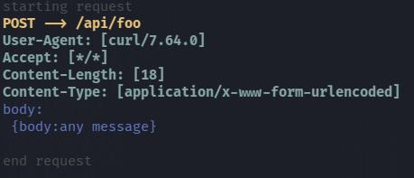

# echo-server

An HTTP echo server designed for testing applications and proxies.


## Running

### Docker

run the command:

```bash
docker run -p 8000:8000 erikcc02/echo-server
```

and call API via curl or web:

```bash
curl -X POST http://localhost:8000/api/foo --data {'body':'any message'}
```



## Configure echo server

to set the port that the application will run, set the value of the variable `ECHOSERVER_PORT`

```bash
docker run -it -p 8555:5000 -e ECHOSERVER_PORT=5000 echo-server
```

## License

[Read More](./LICENSE)